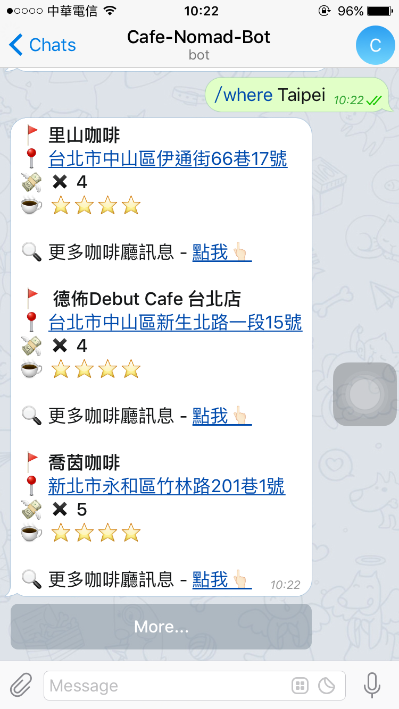

# Telegram Cafe Nomad

This is telegram bot for helping you find cafe store. Thanks [howtomakeaturn](https://github.com/howtomakeaturn) provide this API.

## Usage

**First, You need have telegram account!**  

Add [@BotFather](https://telegram.me/BotFather) and send `/newbot` command to make new Bot, then you will get bot token.  

Setting your **token** into `config.js` and run `yarn install` for installation dependencies.   

After install, you can run `yarn start` for boot up Telegram Bot.

```sh
$ yarn install
$ yarn start
```

## Command

- `/start` - Start telegram bot.
- `/help` - List all command what you can use.
- `/list` - List all city.
- `/where cityName` - You will get random five cafe stores information in that city.
- `/location` - Getting your position and check your city whether in API list, based on your location use Google Maps API calculate close to you cafe store.

## Screenshot



## API

[Cafe Nomad Developer](https://cafenomad.tw/developers/docs/v1.1)

## Related

- [Telegram Bot 開發起手式](Telegram Bot 開發起手式)
- [Telegram Weather Bot (Nodejs)](https://github.com/neighborhood999/telegram-weather-bot)
- [Telegram Weather Bot (Go)](https://github.com/neighborhood999/go-telegram-weather-bot)

## LICENSE

MIT © [Peng Jie](https://github.com/neighborhood999)
